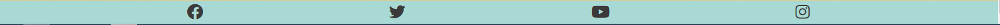

# Muller's Dentistry

## Introduction

### Project Description

[Muller's Dentistry](https://feruzashokirjonovna.github.io/muller-dentistry/) is a website that provides information to people living in Bremen about dentistry, its services. Users find out specific treatment types wchich Muller's team offer.

## Features

### Navigation
- The responsive navigation bar on top of the page includes links to the Home, Service and Contact page. The logo "Dentistry" is linked to the Start page. The navigation bar is identical on each page to enable easy navigation.
- It allows users to navigate between pages on all devices without the need to use the "back" button.

### Home
The Home page is the starting point for users. It provides a short overview of what Muller's Dentistry has to offer. 

### Benefits section
- The Benefits section allows user get in-depth key features which make Muller's dentistry unique.

### Testimonials section
- The Testimonials section gives information about various user experiences.
- It shows warm feedbacks that reflect the high level of expertise, care, and patient-centered approach that sets Muller's Dentistry apart in the eyes of its patients.

### Footer

- The footer area contains links to relevant social media sites (Facebook, Twitter, You Tube and Instagram) to encourage users to keep connected. The icons include alternative text to provide relevant information when screen readers are used. All links open in a new tab to allow easy navigation for the user.

### Service page

-The Service page describes some types of services with clear definitions that Muller's Dentistry offers. 
-In Service page there is also Team section which introduces the stuff of the dentistry to users.

### Contact page

- Contact page gives information about how to get in touch with the Muller's Dentistry.
- Contact page shows the time when the dentistry is open, phone, email, address.

## Future Features
- Include online booking form

## Testing

### Validator Testing

#### HTML

No errors were returned when passing through the [W3C Markup validator](https://validator.w3.org/).

#### CSS

No errors were found when passing through the [W3C CSS Validator](https://jigsaw.w3.org/css-validator/) validator

#### Google Chrome Ligthouse Reports

These reports presents the results of Lighthouse testing to assess the performance, accessibility, best practices and SEO of [Muller's Dentistry](https://feruzashokirjonovna.github.io/muller-dentistry/).

The tests were executed using the Google Chrome browser's DevTools.
All pages score very high in all areas. Details for each page can be found by clicking the expand button.

Lighthouse Report for page Home

Lighthouse Report for page Service

Lighthouse Report for page Contact

### Manual Testing

#### Features Testing

## Browser Testing

Functionality, links, layout, and responsiveness were tested with the following browsers without any issues:

- Google Chrome Version: 119.0.6045.109; (31. Oktober 2023)
- Opera Version: 104.0.4944.36; (30. Oktober 2023)
- Microsoft Edge Version: 119.0.2151.44; (2. November 2023)

## Device Testing

Functionality, links, layout, and responsiveness were tested on the following devices without any issues:

- iPhone X
- Samsung Galaxy A13
- Lenovo Tab P12
- LG 27''

### Findings under Testing

## Deployment

The site was deployed to GitHub pages. The steps to deploy are as follows:

- In the GitHub repository, navigate to the Settings tab
- From the source section drop-down menu, select the Main Branch
- Once the main branch has been selected, the page will be automatically refreshed with a detailed ribbon display to indicate the successful deployment.
  
The live link can be found here - <https://github.com/FeruzaShokirjonovna/muller-dentistry>

## Technology

- IDE: Gitpod
- Repository: Github

## Credits

### Content

Idea, content and text are developed by myself.

Treatment section in Service page is written by my husband, Dr.Mirsidikov.

Inspiration for the layout from walkthrough project "Love Running".

- Fonts from [Google Fonts](https://fonts.google.com/)
- Icons from [Font Awesome](https://fontawesome.com/)
- Map from [Google Maps](https://googlemaps.com)
- Color scheme from [Adobe color](https://color.adobe.com)

### Media

- Hero image on the landing page is taken by myself.
- Woman image in Team section is from [Wavebreak Media](https://wavebreakmedia.com)
- Man image in Team section is from [Pikiwizard](https://pikiwizard.com)
- Background image in Testimonials section is from [Freepik](https://freepik.com)

### Code

Some parts of the code was copied from the Walkthrough project "Love Running" and changed during the project to fit this site.

- Copied Asterisk wildcard selector from the Walkthrough project "Love Running"
- Header & navigation is copied from the Walkthrough project "Love Running"
- Landing page and cover text style is copied from the Walkthrough project "Love Running"
- Footer is copied from the Walkthrough project "Love Running"

Team section is customized from W3Schools tutorial [W3schools](https://www.w3schools.com/howto/howto_css_team.asp)

#### Inspiration and tutorials used from

  - [W3Schools](https://www.w3schools.com/)
  - [Stack overflow](https://stackoverflow.com/)
  - Code Institute Slack Channel
    - Special thanks to David Calikes, my fellow students, and my mentor Precious Ijege.

#### Templates and tutorial for creating the readme-file

  - [bezebee - My First Project](https://github.com/bezebee/My-First-Project/blob/main/README.md)
  - [Drupal Wiki](https://www.drupal.org/docs/develop/managing-a-drupalorg-theme-module-or-distribution-project/documenting-your-project/readmemd-template)
  - [GitHub Docs](https://docs.github.com/en)    

