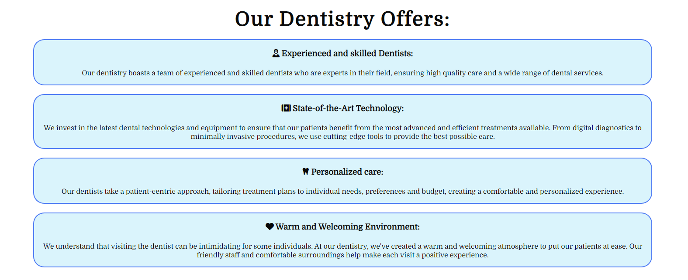

# Muller's Dentistry

## Introduction

### Project Description

[Muller's Dentistry](https://feruzashokirjonovna.github.io/muller-dentistry/) is a website that provides information to people living in Bremen about dentistry, its services. Users find out specific treatment types wchich Muller's team offer.

## User Experience

### User Requirements and Expectations

#### User goals

- Visually appealing, including images.
- Easily navigated around.
- Quality and valuable content.
- Easily found contact details.

#### Site owners goals

- Attract more custumers.
- Inform custumers about the dentistry, its service.
- Make custumers trusted on his team and their experience by sharing feedback from early custumers
- Increase rankings on search engines.

#### Requirements

- Easy to navigate on various screen sizes.
- Clear and precise information about Muller's Dentistry.
- Simple method of contacting the website.
- Visually appealing design.

#### Expectations

- I expect all links to social media sites to be opened in a new tab.
- I expect all navigation links to work correctly.
- I expect screen size not to affect the quality of the website.
- I expect all information to be correct and accurate.

### Wireframes

The wireframes for Muller's website were produced in [Balsamiq](https://balsamiq.com). There are frames for a full width display and a small mobile device. The final site varies slightly from the wireframes due to developments that occured during the creation process. 

 

### Site Structure

Muller's Website website has three pages. The [home page](index.html) is the default loading page, [service page](service.html) and [contact page](contact.html).

### Design Choices

#### Typography

'Domine' is used for the body text as it easy to read for all. Cursive in Testimonials section, so it makes sense of handwriting.

#### Color Scheme

The color scheme was selected to represent feelings of trust and security. Blue and white graphics create a happy atmosphere, easing customers' minds during stressful dental visits.

## Features

### Navigation
- The responsive navigation bar on top of the page includes links to the Home, Service and Contact page. The logo "Dentistry" is linked to the Start page. The navigation bar is identical on each page to enable easy navigation.
- It allows users to navigate between pages on all devices without the need to use the "back" button.
- The navigation bar changes appearance depending on the screen size for better user experience.

### Home
- The Home page is the starting point for users. 
- It provides a short overview of what Muller's Dentistry has to offer. 

### Benefits section

- The Benefits section allows user get in-depth key features which make Muller's dentistry unique.

### Testimonials section

- The Testimonials section gives information about various user experiences.
- It shows warm feedbacks that reflect the high level of expertise, care, and patient-centered approach that sets Muller's Dentistry apart in the eyes of its patients.
- Patient reviews make customer trust and brand awareness. 

### Footer

- The footer area contains links to relevant social media sites (Facebook, Twitter, You Tube and Instagram) to encourage users to keep connected. The icons include alternative text to provide relevant information when screen readers are used. All links open in a new tab to allow easy navigation for the user.

### Service page

- The Service page describes some types of services with clear definitions that Muller's Dentistry offers. 
- In Service page there is also Team section which introduces the stuff of the dentistry to users.
- In team section boxes are styled with a box shadow to 'detach' them from the site to instill a sense of impartiality in the user.

### Contact page

- Contact page gives information about how to get in touch with the Muller's Dentistry.
- Contact page shows the time when the dentistry is open, phone, email, address map and a form.
- There is a form that the user can choose to fill in. It has 5 input fields, name, email, address, callback and a textarea. The call back button lets Muller's Dentistry know if the user would like a callback.

## Future Features

While the current version is fully functional, there are some ideas for future development:
- Add information about price.
- Create a "Contact us today" button on the Home page. 

## Testing

### Validator Testing

#### HTML

No errors were returned when passing through the [W3C Markup validator](https://validator.w3.org/).

- Home page

- Service page

- Contact page

#### CSS

No errors were found when passing through the [W3C CSS Validator](https://jigsaw.w3.org/css-validator/) validator

#### Google Chrome Ligthouse Reports

These reports presents the results of Lighthouse testing to assess the performance, accessibility, best practices and SEO of [Muller's Dentistry](https://feruzashokirjonovna.github.io/muller-dentistry/).

The tests were executed using the Google Chrome browser's DevTools.
All pages score very high in all areas. Details for each page can be found by clicking the expand button.

Lighthouse Report for page Home

Lighthouse Report for page Service

Lighthouse Report for page Contact

### Manual Testing

#### Features Testing

- The links in the navigation bar directs the user to the designated section and homepage.
- The Social Media icons in the footer directs the user to the designated social medias which will open up in a tew tab.

## Browser Testing

Functionality, links, layout, and responsiveness were tested with the following browsers without any issues:

- Google Chrome Version: 119.0.6045.109; (31. Oktober 2023)
- Opera Version: 104.0.4944.36; (30. Oktober 2023)
- Microsoft Edge Version: 119.0.2151.44; (2. November 2023)

## Device Testing

Functionality, links, layout, and responsiveness were tested on the following devices without any issues:

- iPhone X
- Samsung Galaxy A13
- Lenovo Tab P12
- LG Desktop 27''

### Findings under Testing

#### Resolved

- During validation one bug became known during the validation stage, a brief description is below:

This was an oversight from the development phase when the font size was being modified. It was easily fixed by setting the background color as planned.

## Deployment

The site was deployed to GitHub pages. The steps to deploy are as follows:

- In the GitHub repository, navigate to the Settings tab
- From the source section drop-down menu, select the Main Branch
- Once the main branch has been selected, the page will be automatically refreshed with a detailed ribbon display to indicate the successful deployment.
  
The live link can be found here - <https://github.com/FeruzaShokirjonovna/muller-dentistry>

### Cloning

Cloning the repository will allow to download a local version of the repository to be worked on. 

- Find the relevant GitHub repository
- Press the arrow on the Code button
- Copy the link that is shown in the drop-down
- Now open whatever editor for use & select the directory location where needed the clone created
- In the terminal type 'git clone' & then paste the link copied in GitHub
- Press enter and the local clone will be created.

## Technology

- [HTML5](https://html.spec.whatwg.org/) - provides the content and structure for the website.
- [CSS](https://www.w3.org/Style/CSS/Overview.en.html) - provides the styling.
- [Balsamiq](https://balsamiq.com/wireframes/) - used to create the wireframes.
- [Gitpod](https://www.gitpod.io/#get-started) - used to deploy the website.
- [Github](https://github.com/) - used to host and edit the website.

## Credits

### Content

Idea, content and text are developed by myself.

Treatment section in Service page is written by my husband, Dr.Mirsidikov.

Inspiration for the layout from walkthrough project "Love Running".

- Fonts from [Google Fonts](https://fonts.google.com/)
- Icons from [Font Awesome](https://fontawesome.com/)
- Map from [Google Maps](https://googlemaps.com)
- Color scheme from [Adobe color](https://color.adobe.com)

### Media

- Hero image on the landing page is taken by myself.
- Woman image in Team section is from [Wavebreak Media](https://wavebreakmedia.com)
- Man image in Team section is from [Pikiwizard](https://pikiwizard.com)
- Background image in Testimonials section is from [Freepik](https://freepik.com)

### Code

Some parts of the code was copied from the Walkthrough project [Love Running Project](https://github.com/AlexSunner/love-running) and changed during the project to fit this site.

- Copied Asterisk wildcard selector from the Walkthrough project "Love Running"
- Header & navigation is copied from the Walkthrough project "Love Running"
- Landing page and cover text style is copied from the Walkthrough project "Love Running"
- Testimonials section is copied from the Walkthrough project "Love Running"
- Footer is copied from the Walkthrough project "Love Running"
- Team section is customized from W3Schools tutorial [W3schools](https://www.w3schools.com/howto/howto_css_team.asp)

#### Inspiration and tutorials used from

  - [W3Schools](https://www.w3schools.com/)
  - [Stack overflow](https://stackoverflow.com/)
  - Code Institute Slack Channel

#### Templates and tutorial for creating the readme-file

  - [bezebee - My First Project](https://github.com/bezebee/My-First-Project/blob/main/README.md)
  - [Drupal Wiki](https://www.drupal.org/docs/develop/managing-a-drupalorg-theme-module-or-distribution-project/documenting-your-project/readmemd-template)
  - [GitHub Docs](https://docs.github.com/en)    

## Acknowledgements
The site was completed as a Portfolio 1 Project for the Full Stack Software Developer Diploma at the [Code Institute](https://codeinstitute.net/). As such I would like to thank my mentor [Precious Ijege](https://www.linkedin.com/in/precious-ijege-908a00168/), David Calikes - cohort facilitator, the Slack community, and all at the Code Institute for their help and support. Muller' Dentistry is a fictional dentistry.

Orifjonova Feruza Shokirjonovna, 2023.